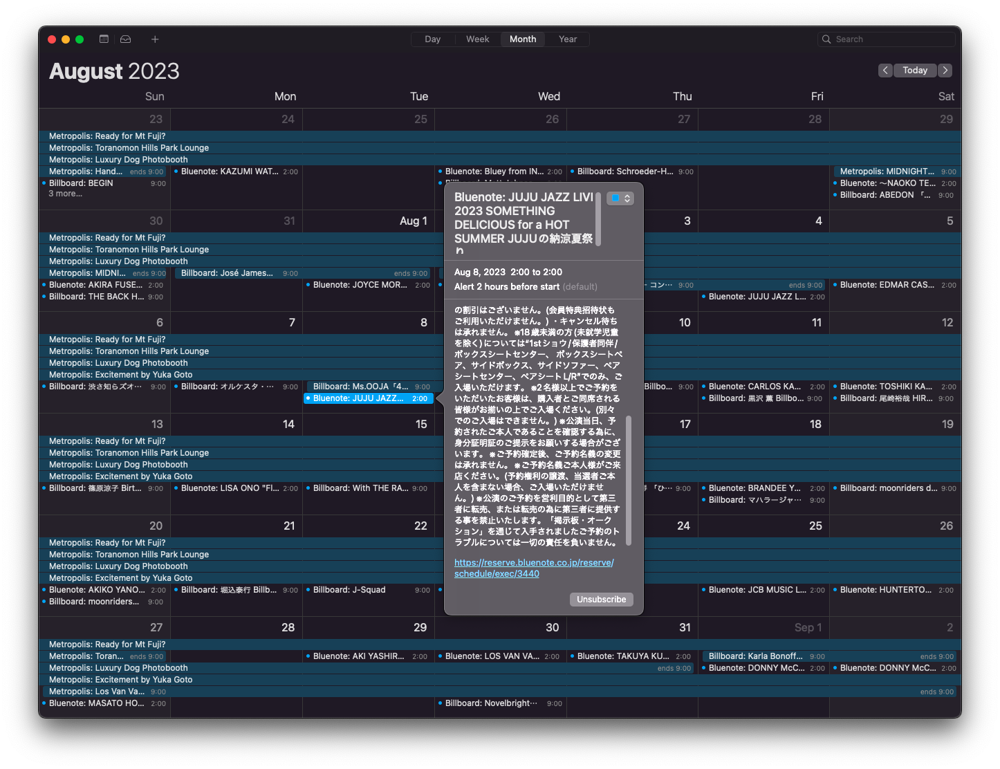

# Calendar Aggregator


I'm always missing amazing events in Tokyo.
This the first part of an event aggregator aimed at placing almost every event I can find online into a calendar using
Python to scrape the events and Laravel to distribute the events as an iCal format.


To install, you need a basic Laravel setup. In ```.env``` add your database credentials. In the project directory run:

```sh
    composer install
    sail artisan migrate
    sail artisan db:seed
```

Enjoy :)
# Show events in a calendar
Adding urls to your calendar will import the .ics endpoint and display the events in your calendar

User 1's events ```http://localhost/api/v1/user/events```

All possible events ```http://localhost/api/v1/events```

# Import events
if you have a valid file with an array of events such as:
```json
{
    "name": "ジョー featuring アルジェブラ",
    "image_url": "http://www.billboard-live.com/event_img/main/detail/dtl_06005_1.jpg?649d167e6bc7c4.72021422",
    "description": "甘美なバラードに酔いしれる夜",
    "datetime_string": "2007/8/30（木） - 9/4（火）",
    "starts_at": "2007-8-30",
    "ends_at": "2007-9-4", 
    "unique_identifier": "http://www.billboard-live.com/pg/shop/show/index.php?mode=detail1&event=6005&shop=1",
    "url": "http://www.billboard-live.com/pg/shop/show/index.php?mode=detail1&event=6005&shop=1"
}

```
Truncate `events` and `events_user`.
place it inside of `the storage/app/events` directory and run:
``` sail artisan app:import-events```

Look inside of the commands directory to see what the files should be called.
After import run `sail artisan db:seed --class=EventUserSeeder`

# Running tests
You must first setup test database

Copy .env to .env.testing and edit the database details to point to a test database
`php artisan migrate --env=testing`

Now run:
`sail artisan test`
